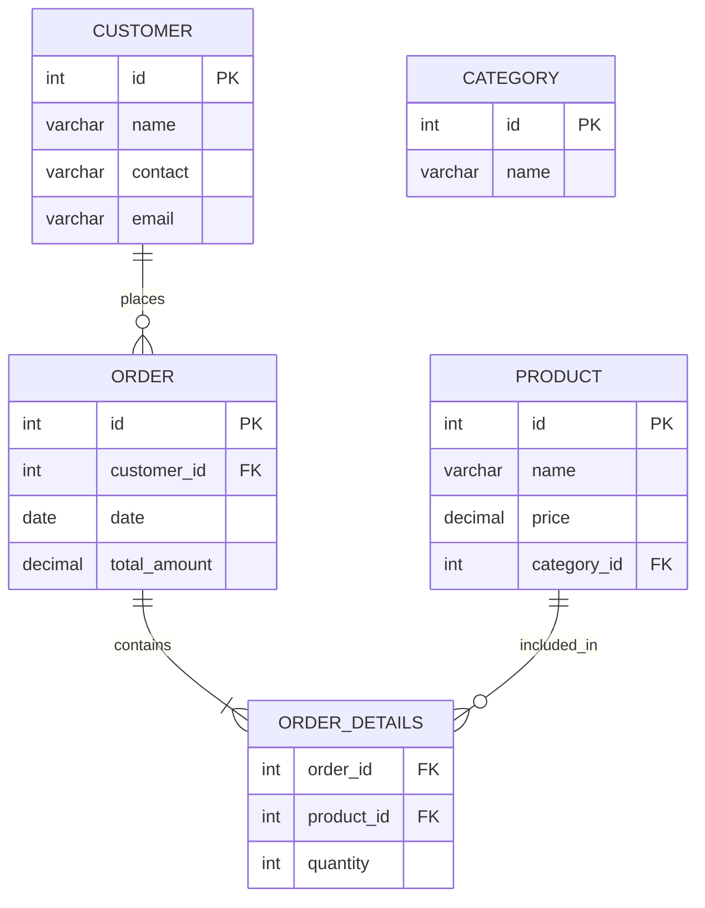

# 🛍️ Shopi

Online store database implementation with MySQL

## Entity Relationship Diagram (ERD):

```mermaid
erDiagram
    CUSTOMER ||--o{ ORDER : places
    ORDER ||--|{ ORDER_DETAILS : contains
    PRODUCT ||--o{ ORDER_DETAILS : included_in

    CUSTOMER {
        int id PK
        varchar name
        varchar contact
        varchar email
    }

    CATEGORY {
        int id PK
        varchar name
    }

    PRODUCT {
        int id PK
        varchar name
        decimal price
        int category_id FK
    }

    ORDER {
        int id PK
        int customer_id FK
        date date
        decimal total_amount
    }

    ORDER_DETAILS {
        int order_id FK
        int product_id FK
        int quantity
    }
```
